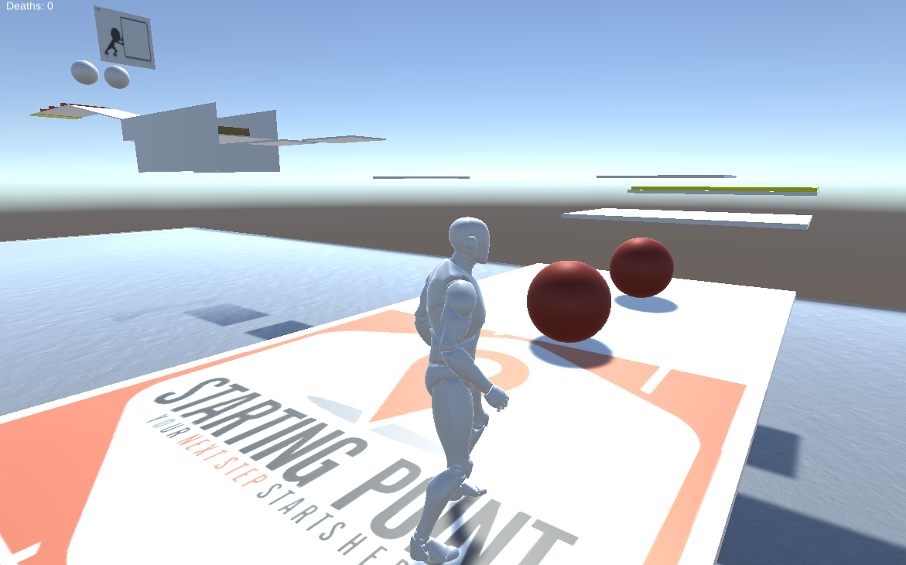

# Zombie-Runner
### A 3D video game created in Unity with scripting in C#
This video game was created as an introduction to game development and object-oriented programming concepts.

Here is a link to play it in browser: https://simmer.io/@kana2001/zombie-runner

## Controls
- Use <i>WASD</i> to move your player
- Use <i>Shift</i> to run
- Use <i>Spacebar</i> to run
- Use <i>Tab</i> to enter precision mode (player faces the direction the mouse move) TIP: Helpful for zombies that chase you 
- Red objects are lethal and result in <b>death</b>
- Yellow objects are checkpoints! Upon death, you will respawn at the latest reached checkpoint
